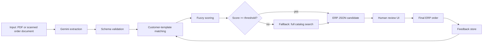

# Architecture for the Order-Capture Pipeline

## Core Flow



## Components

## Architecture Choices Are Open

The architecture below describes responsibilities, not one required technology stack. The starter app uses a Python backend and Pydantic-style validation because it is compact and readable for teaching.

Student teams should use Gemini and Antigravity to compare options before they decide. FastAPI, Flask, Node/TypeScript, notebooks, CLIs, or another local structure can all be valid if the team can justify security, validation, review workflow, local storage, and maintainability.

### Input Adapter

Accepts a PDF or scanned order document. In the course prototype, a file upload is enough. Text, image, or audio channels can be added later as optional extensions.

### Gemini Extraction

Use the Google Gen AI SDK to turn messy input into a typed `ExtractedOrder` object. The model should return only fields that can be validated.

Use Pydantic, JSON Schema, Zod, or an equivalent validation layer to reject malformed model output before matching or ERP handoff.

### Catalog and Customer Template

Maintain two lookup sets:

- full catalog: all product codes and descriptions;
- customer template: products the customer usually orders.

The template is a smaller first-pass search space and should reduce false positives.

### Matching Engine

Suggested scoring features:

- normalized edit similarity;
- token overlap;
- synonym table, for example `oil -> Sonnenblumenoel`;
- package-size hints, for example `10l`, `180er`, `1kg`;
- customer history boost.

The starter app uses a simple fuzzy matcher. Student teams can improve it with embeddings, learned weights, or feedback-aware ranking.

### Review Frontend

The frontend should show:

- original input or recognized raw text;
- proposed article code and description;
- confidence score;
- alternatives;
- editable quantity/unit;
- a clear finalization action;
- feedback submission.

### Feedback Loop

The simplest feedback store is JSONL:

```json
{"customer_code":"CUST-001","raw_text":"big chef oil 2","chosen_code":"OEG25","timestamp":"2026-05-12T10:30:00Z"}
```

Later, teams can aggregate feedback into:

- customer templates;
- synonym dictionaries;
- examples passed back into Gemini prompts;
- evaluation sets for regression testing.

Good local storage choices:

- JSONL for append-only feedback;
- SQLite for catalog, customer templates, feedback, and evaluation cases;
- DuckDB for local analytics over larger article or order-history tables;
- Chroma or FAISS only if embedding-based matching becomes part of the design.

## What Should Be AI and What Should Be Code?

Use Gemini for:

- document and OCR-like interpretation of PDFs or scanned pages;
- resolving ambiguous natural language;
- producing candidate structured order lines;
- explaining why a candidate was selected.

Use deterministic code for:

- schema validation;
- catalog matching and ranking;
- confidence thresholds;
- ERP output validation;
- authorization and audit logging;
- preventing unsupported products from being sent downstream.
