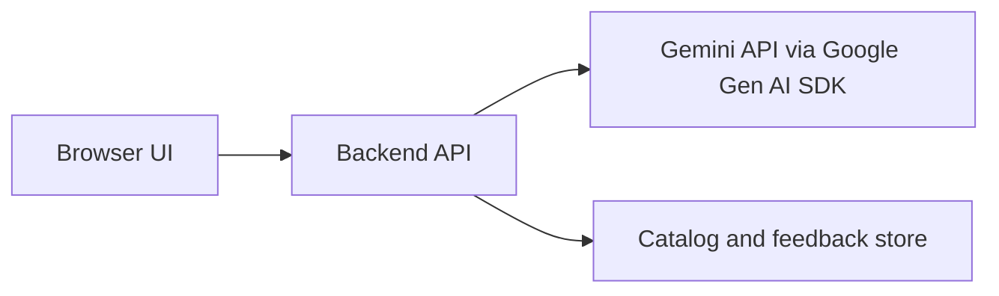

# Frontend Options

The frontend should let a human inspect and correct the order before it becomes an ERP record.

## Recommended Course Pattern

For this project, the safest beginner pattern is:



The browser never sees `GEMINI_API_KEY`. The backend calls Gemini, validates responses, and returns safe JSON to the frontend.

The starter app implements this pattern with FastAPI, but that is not mandatory. Flask, Node/TypeScript, a notebook, a CLI, or another local structure can be appropriate if the team explains the tradeoffs.

Before building, teams should ask Gemini or Antigravity to compare two or three candidate architectures for this specific PDF order-capture problem. The final decision should be owned by the team, not copied blindly from the AI answer.

## Local Storage Options

Start with storage that is easy to inspect and easy to reset.

Good options:

- JSONL for an append-only feedback log;
- SQLite for catalog, customer templates, feedback, and evaluation cases;
- DuckDB for larger tabular data or local analytics;
- Chroma or FAISS only if the team uses embeddings for matching.

Ask Gemini or Antigravity to install and wire the selected storage layer, but require a small test that proves data is written and read correctly.

## Minimum UI Requirements

Students should build a frontend that supports:

- PDF or scanned-document upload;
- optional text input for debugging;
- extraction request;
- raw recognized text display;
- matched article rows;
- alternatives for low-confidence matches;
- editable quantity;
- final confirmation;
- feedback submission.

## Useful Antigravity Prompts for UI Work

```text
Build the smallest possible review UI for the existing backend endpoint.
Show raw text, matched article, confidence, and alternatives.
Keep the Gemini API key server-side only.
```

```text
Add a feedback form for corrected article codes.
Store feedback by calling a backend endpoint.
Add a small test or manual verification notes.
```

## Sources

- Google Gemini API libraries: https://ai.google.dev/gemini-api/docs/libraries
