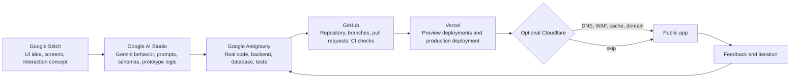

# AI App Workflow and CI/CD Flow for Students

⚠️ This document describes an optional advanced workflow. It is NOT required for the baseline assignment submission.

This flow shows the complete path from AI-assisted product design to a deployed app:

**Google Stitch -> Google AI Studio -> Google Antigravity -> GitHub -> Vercel**

Strictly speaking, CI/CD starts at GitHub. Google Stitch, Google AI Studio, and Google Antigravity are the upstream design, prototyping, and development phases.

There are three versions of this diagram:

- `ci_cd_flow.html`: browser handout for students.
- `06_ci_cd_flow.md`: Markdown/GitHub documentation.
- `ci_cd_flow.excalidraw`: editable Excalidraw diagram. Import/open this file in Excalidraw.

## Recommended Workflow



## Flow With Rationale

| Step | Tool | Rationale |
| --- | --- | --- |
| 1 | Google Stitch | Start with the interface and product flow. Students quickly see which screens, actions, and data objects the app actually needs. |
| 2 | Google AI Studio | Test the AI behavior separately: prompts, uploaded files, structured JSON output, model limits, and failure cases. This prevents UI problems and model problems from getting mixed together. |
| 3 | Google Antigravity | Turn the prototype into a real application: clean frontend, backend routes, database integration, authentication, validation, environment variables, and tests. |
| 4 | GitHub | Make the work reproducible and reviewable: commits, branches, pull requests, issues, code review, and automated CI checks. |
| 5 | Vercel | Vercel pulls directly from GitHub and creates preview deployments for pull requests plus production deployments from `main`. This gives students live URLs with very little operations overhead. |
| Optional | Cloudflare | Add it when DNS, custom domains, WAF/security, caching, or edge routing are part of the learning goals. For a normal student app, Cloudflare is useful but not required. |

## What Is Actually CI/CD?

- **CI, Continuous Integration:** Every push or pull request starts automated checks, for example linting, unit tests, schema tests, and build checks.
- **CD, Continuous Deployment/Delivery:** Successful changes are deployed automatically or semi-automatically. With Vercel, the GitHub integration typically creates preview deployments for pull requests and production deployments from the production branch.
- **Not CI/CD, but still central:** Google Stitch design, AI Studio prompting, and Antigravity coding. These steps prepare the code that later enters CI/CD.

## Standard Architecture

Yes, this is a very common modern architecture:

1. Students design the UI and interaction concept in **Google Stitch**.
2. They test Gemini prompts, structured outputs, and API behavior in **Google AI Studio**.
3. They implement the real application in **Google Antigravity**.
4. The code is pushed to **GitHub**.
5. **GitHub Actions** or Vercel's Git integration runs tests and builds.
6. **Vercel** deploys the frontend and serverless/backend routes.
7. **Cloudflare** can optionally sit in front for DNS, domain management, security, and caching.

Cloudflare is useful, but not mandatory. For many student projects, GitHub plus Vercel is already enough. Cloudflare is worth adding when students should learn DNS, custom domains, WAF, cache rules, or edge security.

## Short Rationale

Use **Google Stitch** for product shape, **Google AI Studio** for model behavior, **Google Antigravity** for real implementation, **GitHub** for collaboration and CI, and **Vercel** for fast deployment.

## Minimal GitHub Actions Example

```yaml
name: CI

on:
  push:
    branches: [main]
  pull_request:

jobs:
  test:
    runs-on: ubuntu-latest
    steps:
      - uses: actions/checkout@v4
      - uses: actions/setup-python@v5
        with:
          python-version: "3.12"
      - name: Install dependencies
        run: |
          python -m pip install --upgrade pip
          pip install -r student_kit/starter_app/requirements.txt
      - name: Run tests
        run: pytest student_kit/starter_app/tests
```

## Teaching Notes

- Every team should protect API keys with environment variables. No Gemini API key belongs in GitHub.
- Ask students to submit a screenshot or link to their Vercel preview deployment.
- Ask students to explain what their CI checks prove and what they do not prove.
- For backend and database work, require a clear separation between local development data, preview data, and production data.

## Sources

- Google Stitch: https://blog.google/innovation-and-ai/models-and-research/google-labs/stitch-ai-ui-design/
- Google AI Studio: https://ai.google.dev/aistudio
- Google Antigravity: https://developers.googleblog.com/en/build-with-google-antigravity-our-new-agentic-development-platform/
- Vercel Git deployments: https://vercel.com/docs/deployments/deployment-methods
- Vercel for GitHub: https://vercel.com/docs/deployments/git/vercel-for-github
- GitHub Actions deployments: https://docs.github.com/en/actions/how-tos/deploy/configure-and-manage-deployments/control-deployments
- Cloudflare DNS: https://developers.cloudflare.com/dns/
